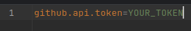
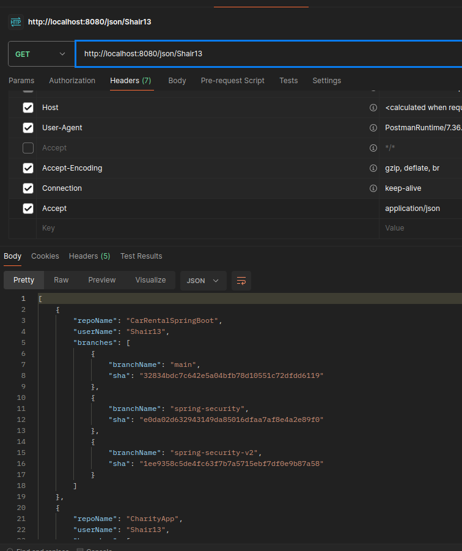
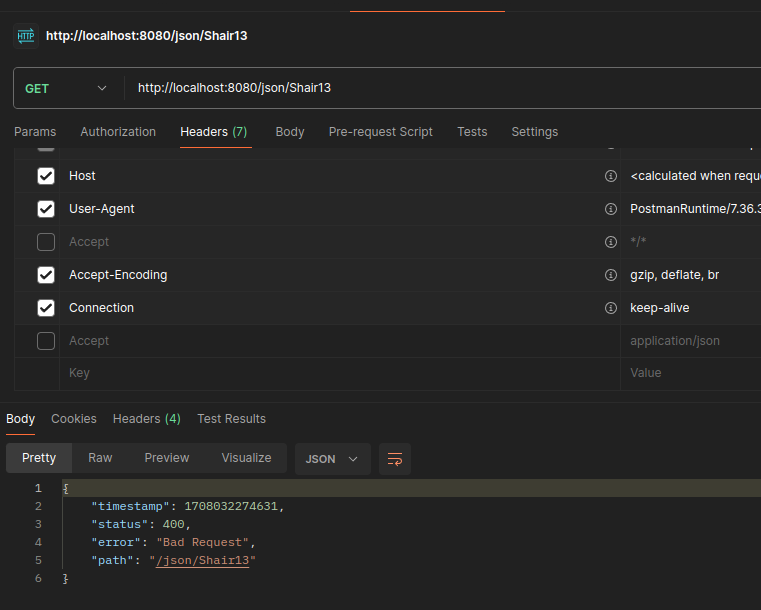
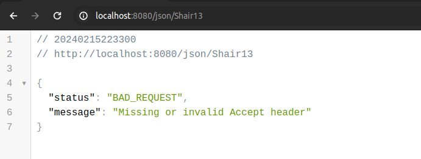
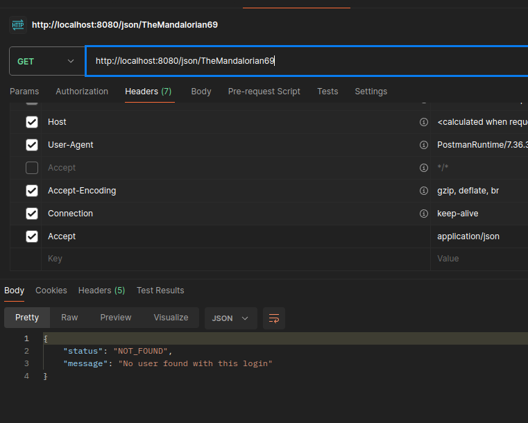
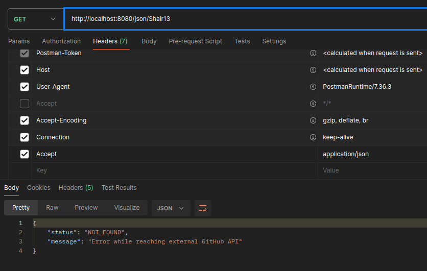
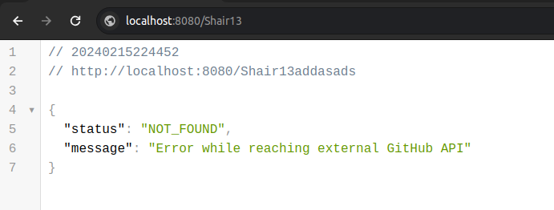

# GitHub API - Repositories and Branches by User's Login 

## Description

This Java application (built using Java 17 and Spring Boot 3) utilizes the GitHub API to search for repositories and their branches based on the provided user login in the URL. The API response will contain a list of repositories belonging to the specified user along with their branches and the last SHA for each. Only repositories that are not forks will be included in the response.

# Run the application

# Docker

```
docker run -p 8080:8080 ghcr.io/shair13/github-rest-api:v1
```

Application will run at 

```
localhost:8080/json/Shair13
```
for json format or

```
localhost:8080/Shair13
```
for HTML format

# Clone

### Steps:

1. **Clone the Repository:** Clone this repository to your local machine using the following command in your terminal:

   **HTTPS**
    ```
    git clone https://github.com/Shair13/GitHub-rest-api.git
    ```
   **SSH**
   ```
    git clone git@github.com:Shair13/GitHub-rest-api.git
   ```
   Optionally, to increase the number of possible requests after cloning the application, you can add your GitHub token to the `application.properties` file.

   

3. **Build the Application:** Navigate to the repository folder and use the Maven command to build the application:

    ```bash
    mvn package
    ```

4. **Run the Application:** After building the application, navigate to the `target` folder and run the application
   using the following command:

    ```bash
    cd target
    java -jar GitHub-rest-api-0.0.1-SNAPSHOT.jar
    ```
5. **Access the Application:** Once the application is running, you can access the API using the URLs specified below:

## The API is divided into 2 endpoints:

#### Endpoint 1: JSON Format Data

**URL**: `http://localhost:8080/json/{login}`

Replace `{login}` with the GitHub username you want to search for.

Please use an application such as Postman to set the appropriate header:
- **Key**: Accept
- **Value**: application/json.



Otherwise, you will receive an error.



The same issue will occur when using a web browser.



In case the user login is not found, there will be an error response in JSON format.



It's also possible that your token may expire or you do not have a token. In those cases, you will receive an error.



### Endpoint 2: HTML Format Data

**URL**: `http://localhost:8080/{login}`

Replace `{login}` with the GitHub username you want to search for.

This endpoint can be opened in any web browser.


In case the user login is not found, there will be an error response in JSON format.


Expired tokens may cause issues. In those cases, you will receive an error.




## Contact

If you have any questions, feedback, or issues, feel free to reach out to me.

- Email: cezary.wozakowski@gmail.com
