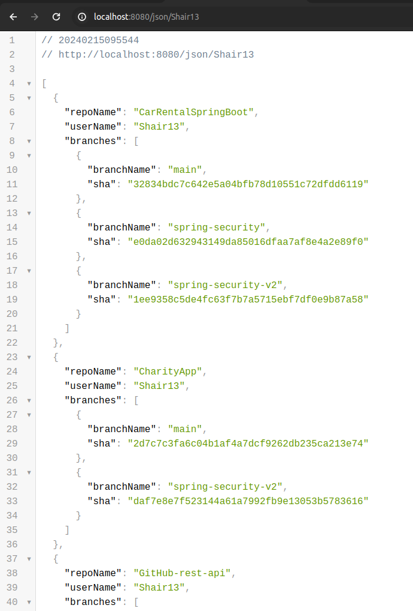
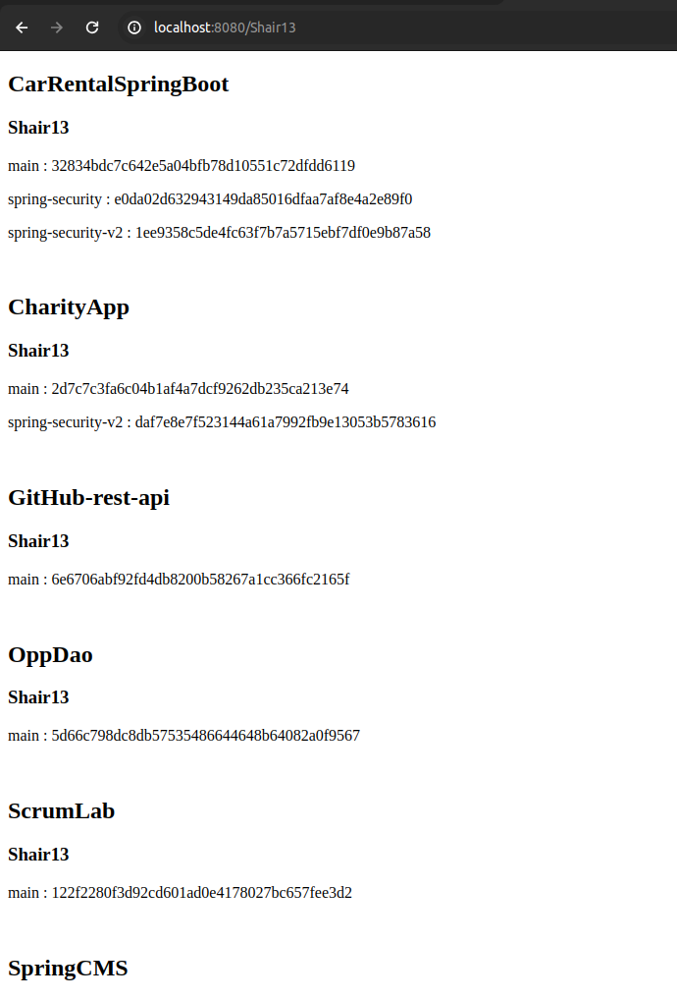
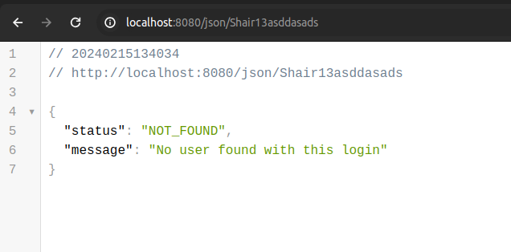

# GitHub API - Repositories and Branches by User's login

## Description

This Java application (built using Java 21 and Spring Boot 3) utilizes the GitHub API to search for repositories and their branches based on the provided user login in the URL. 
The API response will contain a list of repositories belonging to the specified user along with their branches and the last SHA for each. 
Only repositories that are not forks will be included in the response.

## Instructions

1. Clone Repository: Clone this repository to your local machine.

2. Run the Application: Open the project in your preferred IDE (e.g., IntelliJ IDEA, Eclipse) and run the application

3. Accessing the API: Once the application is running, you can access the API using the specified URL format:

For JSON format data: http://localhost:8080/json/{login}

For more user-friendly HTML format data: http://localhost:8080/{login}

Replace {login} with the GitHub username you want to search for.

In case the user login is not found, there will be an error response in JSON format.

# Contact

If you have any questions, feedback or issues, feel free to reach out to me:

- Email: cezary.wozakowski@gmail.com
